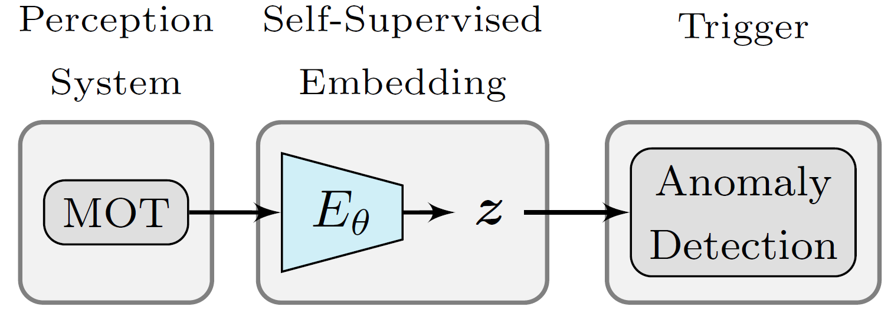
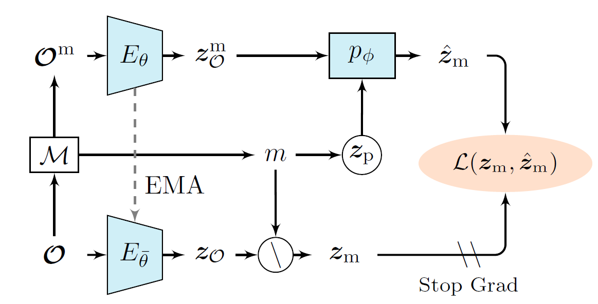

<p align="center">
  <h1 align="center"><strong>Online Monitoring Framework for Automotive <br>Time Series Data using JEPA Embeddings
    </strong></h1>
    <p align="center">
<b>Self-supervised object embeddings for label-free anomaly detection in autonomous driving</b>
</p>
<p align="center">
  <a href="https://ieee-iv.org/2026/">
  
  </a>
  <a href="https://arxiv.org/abs/2501.03666">
  
  </a>
  
  
</p>

  <p align="center">
      <a href="https://www.linkedin.com/in/alexanderfertig/" >Alexander Fertig</a><sup>1</sup>,&nbsp;&nbsp;    
      <a href="https://www.linkedin.com/in/karthikeyan-chandra-sekaran-54b165227/" >Karthikeyan Chandra Sekaran</a><sup>2</sup>,&nbsp; &nbsp;
      <a href="https://www.linkedin.com/in/lakshman-balasubramanian-50548477/" >Lakshman Balasubramanian</a><sup>2</sup>&nbsp; and &nbsp;
      <a href="https://www.thi.de/personen/prof-dr-ing-michael-botsch/" >Michael Botsch</a><sup>1,2</sup>&nbsp;&nbsp;
    <br>
    <small><sup>1</sup>Technische Hochschule Ingolstadt, AImotion Bavaria, Esplanade 10, 85049 Ingolstadt, Germany</small>
    <br>
    <small><sup>2</sup>Technische Hochschule Ingolstadt, Research Center CARISSMA , Esplanade 10, 85049 Ingolstadt, Germany</small>
  </p>
</p>


<br>
<br>

## Overview

This repository provides the official implementation of our IEEE IV 2026 paper:

**"Online Monitoring Framework for Automotive Time Series Data using JEPA Embeddings"**

Paper Links:
- arXiv: [TBD](https://arxiv.org/abs/2501.03666)
- IEEE Xplore: to be announced


> **Abstract:** As autonomous vehicles are rolled out, measures must be taken to ensure their safe operation. These run continuously online in the background, supervising the system status and recording anomalies. This work proposes an online monitoring framework to detect anomalies in object state representations. Thereby, a key challenge is creating a framework for anomaly detection without anomaly labels, which are usually unavailable for unknown anomalies. To address this issue, this work applies a self-supervised embedding method to translate object data into a latent representation space. For this, a JEPA-based self-supervised prediction task is constructed, allowing training without anomaly labels and the creation of rich object embeddings. The resulting expressive JEPA embeddings serve as input for established anomaly detection methods, in order to identify anomalies within object state representations. This framework is particularly useful for applications in real-world environments, where new or unknown anomalies may occur during operation for which there are no labels available. Experiments are performed on the publicly available, real-world nuScenes dataset to illustrate the framework's capabilities.


<br>
<br>

## Architecture Overview

<b>(a)</b> Overview of the online monitoring framework: In the perception system Multi-Object Tracking (MOT) is performed to obtain object state estimations, which are encoded by the object encoder $E_{\theta}$ into latent embeddings ${z}$ and used for anomaly detection.
<b>(b)</b> Architecture of the JEPA-based self-supervised embedding method.

<table align="center">
  <tr>
    <td align="center">
      <br>
      <b>(a)</b> Online monitoring framework
    </td>
    <td align="center">
      <br>
      <b>(b)</b> JEPA-based self-supervised embedding architecture
    </td>
  </tr>
</table>


<br>
<br>

## Setup

#### Requirements
- Python 3.8+
- PyTorch 1.9+
- CUDA 12.x (optional, for GPU support)

### Installation
1. Clone this repository
2. Create an environment and install dependencies:
```bash
pip install -r requirements.txt
```

3. Download the processed database from [Data-Link](https://faubox.rrze.uni-erlangen.de/getlink/fiSsrNqZMH2dg7W8q7MaEF/nuscenes) and unzip it into the `\data`, resulting in:
```bash
data/nuscenes/train/base/
data/nuscenes/val/base/

```
Each sample corresponds to one nuScenes scene, which contains the object lists from different sensor modalities. 


### Development environment
This code was developed and tested on a platform with Windows 11, using CUDA 12.6 on an NVIDIA RTX 5000 Ada Generation.


<br>
<br>

## Code Usage

These commands initiate the training process and save the resulting models and logs.

### Model Training
To train the JEPA encoder and evaluate the online monitoring framework:
```bash
python main.py
```
During training, the object encoder learns to generate latent representations for each input object, thereby structuring the latent embedding space.
During evaluation, these learned object embeddings are used to fit and apply the anomaly detection components.


### Baseline
For comparison, the same anomaly detection procedure is applied to the raw data by
```bash
python main_baseline.py
```

## Citation
```
@INPROCEEDINGS - TBD
```

